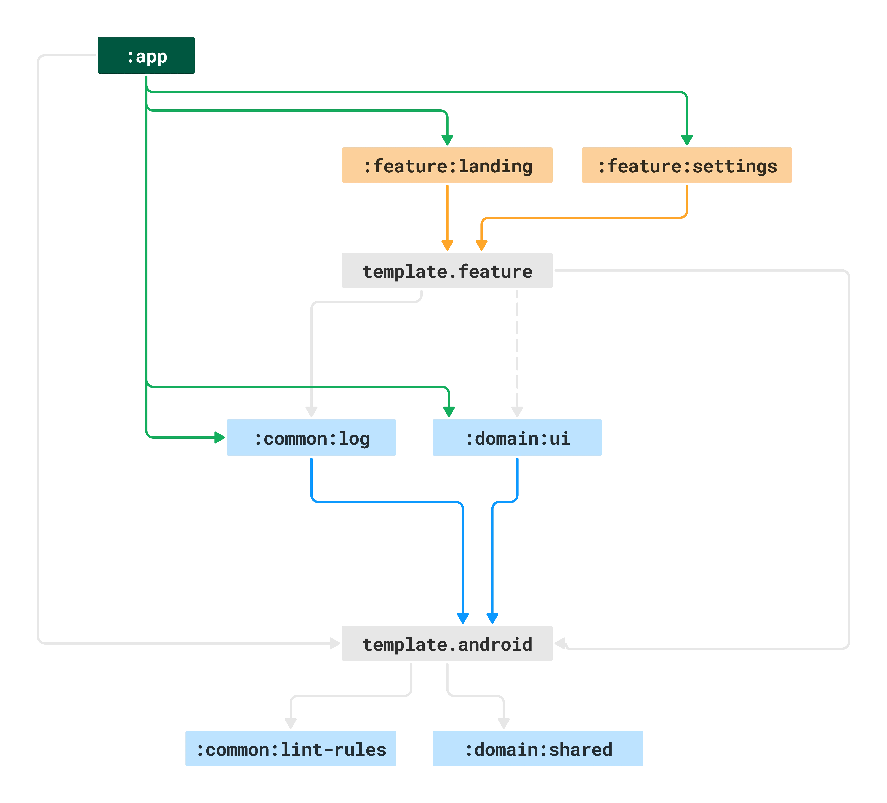

# Playground Android

This is a template project for Android development. I use it as a way
to test new concepts or integrate libraries that are otherwise hard
in a more complex project.

Some of the concepts implemented here:

- [x] [multi module](#app-module-diagram-multi-module-setup) setup
- [x] [sharing build logic](./build-logic/README.md) with [gradle convention plugin](https://docs.gradle.org/current/samples/sample_convention_plugins.html)
- [x] gradle [version catalog](https://github.com/kaushikgopal/playground-android/blob/master/gradle/libs.versions.toml), BOM & Bundles (one source of truth)
- [x] [custom lint-rules](https://github.com/kaushikgopal/playground-android/pull/5/files)
- [x] compose-navigation between feature modules
- [x] [Makefile](https://github.com/kaushikgopal/playground-android/blob/master/Makefile) with common cli commands
- [x] dependency injection with kotlin-inject
  - [x] [function-injection](https://github.com/kaushikgopal/playground-android/pull/9/commits/aad254957a003982633006fb2f350ee7a372f11d) demo in `@Composable`
- [x] [logcat](https://github.com/square/logcat) lib and injecting [multiple loggers](https://github.com/kaushikgopal/playground-android/blob/master/common/log/src/main/java/sh/kau/playground/common/log/CompositeLogger.kt)
- [ ] add basic networking lib
- [ ] use [Coil](https://coil-kt.github.io/coil/) for image loading
- [ ] USF architecture (much like [usf-movies-android](https://github.com/kaushikgopal/movies-usf-android))

# Getting started
- Download this repository and open the template folder on Android Studio
- in libs.versions.toml change app-namespace to your desired package name
- in AndroidStudio rename the app package sh.kau.playground
- Check if the manifest package was renamed along with the package
- In app/build.gradle.kts, change the applicationId to the new app package

Ready to Use and you're ready to start working on your new app!

# App module diagram (multi-module setup)

Below diagram should give you an idea of how the inter module dependencies are setup.
In practice, when you add feature modules it is pretty straightforward as the
core requirements are already setup. See the [Landing feature's build.gradle.kts file](https://github.com/kaushikgopal/playground-android/blob/master/features/landing/build.gradle.kts)
as an example for how simple the build script for new features land up being.

The dependency graph is widest at the top (`:app` module)
and becomes more focused and self-contained as you move down through domain and common modules.
So modules at the bottom have lesser dependencies and are more self-contained.

- new features are added to :features module
- the core :app module itself assembles all the dependencies (and is intentionally lean)
- :domain:app is a special module with app level dependencies but one that features can depend on
    - without causing a cyclic dependency back to the main :app module
- template.feature = custom gradle plugin that sets up a fully functional feature for your app
- template.android = custom gradle plugin that has the things you need for a pure android lib
    - think jvm target, minSDK etc. that you don't want to repeat everywhere
- :common modules are shared but can be hot-swapped with another implementation (possible)
- :domain modules are specific to the app but also shared (but not intended to be swapped out)